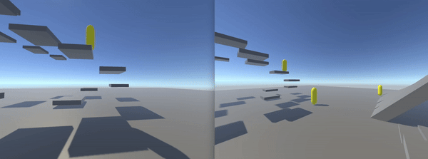

# Unity First Person Rigidbody Controller with Client Side Prediction using Riptide Networking

<p align="center">
  
</p>

# Purpose

This project implements a first person rigidbody controller with client side prediction using Riptide Networking. The rigidbody supports crouching, sliding, jumping and other basic movement. I recommend you check out [UnityRiptidePhysics](https://github.com/JasonLash/UnityRiptidePhysics) and [UnityRiptideSimpleFPRigidbody](https://github.com/JasonLash/UnityRiptideSimpleFPRigidbody) before.

# Overview
### PlayerMovement.cs

It is important for the server and client to share the same movement code. Both unity projects share the same PlayerMovement.cs script. The movement is based on Dani movement https://github.com/DaniDevy/FPS_Movement_Rigidbody 


We decouple the look direction so when reconciling you can replay the player with the same inputs and look direction. 

```cs
PhysicsStep(bool[] inputs, Quaternion lookDirection)
```


# Acknowledgements

https://github.com/RiptideNetworking/Riptide

https://www.youtube.com/@tomweiland

https://www.codersblock.org/blog/client-side-prediction-in-unity-2018

https://github.com/spectre1989/unity_physics_csp

https://gafferongames.com/

https://github.com/DoctorWh012/Client-Side-Prediction-Physics

https://github.com/DaniDevy/FPS_Movement_Rigidbody
